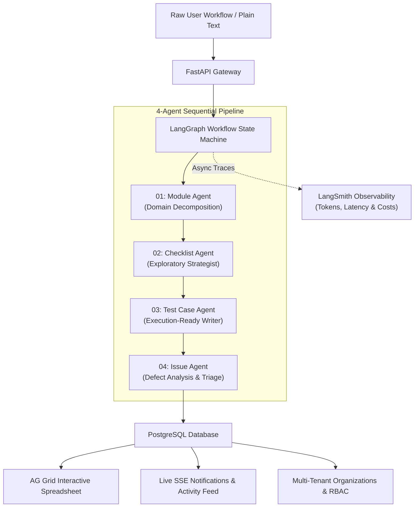

<div align="center">

# BugMind AI
### Autonomous QA Workflow Engine & Exploratory Test Management Platform

An AI-powered testing and quality engineering workspace that transforms plain-text software workflows into domain architectures, exploratory checklists, execution-ready manual test cases, and triaged defect reports.

[](https://python.org)
[](https://fastapi.tiangolo.com)
[](https://langchain-ai.github.io/langgraph/)
[](https://react.dev)
[](https://vitejs.dev)
[](https://tailwindcss.com)
[](https://ag-grid.com)
[](https://www.postgresql.org)
[](https://azure.microsoft.com)

</div>

---

## ⚡ Overview

**BugMind AI** eliminates manual test writing overhead and untested edge cases by orchestrating a deterministic **4-agent state machine** powered by **LangGraph**. By ingesting product requirements, user stories, or plain-text workflow steps, BugMind decomposes functional modules, synthesizes boundary conditions, writes step-by-step test cases, and syncs everything with an AG Grid-powered execution spreadsheet.

Designed with a developer-first aesthetic inspired by Linear and Vercel, BugMind features high-velocity typography (Geist Sans + JetBrains Mono), flat hairline borders, instant-reveal smart navigation, and complete BYOK (Bring Your Own Key) privacy.

---

## 🏗️ System Architecture



---

## ✨ Key Features

### 1. 🤖 Orchestrated 4-Agent LangGraph Pipeline
- **01: Module Agent**: Partitions application workflows into clean domain boundaries, critical paths, and risk-rated modules.
- **02: Checklist Agent**: Synthesizes exploratory checklists, edge cases, negative numbers, boundary values, and security checkpoints.
- **03: Test Case Agent**: Generates structured, execution-ready test cases (`TC-xxxx`) with prerequisites, reproduction steps, and expected outcomes.
- **04: Issue Agent**: Classifies bug observations, pinpoints root causes, and generates standardized defect tickets (`BUG-xxxx`).
- **Conditional Circuit Breaking**: Automatic error interception ensures that if any upstream agent fails or API keys expire, execution safely halts without cascading hallucinations.

### 2. 📊 High-Density Spreadsheet Control (AG Grid)
- **Spreadsheet Ergonomics**: Inline cell editing, keyboard navigation, column reordering, sorting, and multi-field filtering.
- **Custom Column Engine**: Support for dynamic `cf_` custom fields per project (rename, delete, restore, and preserve state).
- **Import / Export**: Full spreadsheet import and export via `.xlsx` and `.csv` without losing custom field definitions.
- **3D Swiping Test Deck**: Interactive swipeable test deck synchronized directly with the AG Grid table below.

### 3. 🔭 Observability & Telemetry (LangSmith Natively Supported)
- **Zero-Code LangSmith Tracing**: Native support for LangChain/LangGraph trace streaming.
- **Token & Cost Tracking**: Monitor exact prompt tokens, completion tokens, latency bottlenecks, and run costs ($).
- **Terminal ASCII Inspection**: View your compiled agent graph directly in your command line:
  ```powershell
  .venv\Scripts\python.exe -c "from graph import workflow_graph; print(workflow_graph.get_graph().draw_ascii())"
  ```

### 4. 🎨 Developer-First Design System
- **High-Velocity Typography**: Built with **Geist Sans** for UI scannability and **JetBrains Mono** for test IDs, code snippets, and terminal logs.
- **No Generic AI Gradients**: Replaced candy pastel pills with sharp numbered monospace tokens (`01`, `02`, `03`) and flat hairline borders.
- **Smart Sticky Header**: Slides away smoothly on scroll down and **instantly reveals** on scroll up (`translate-y-0`) with glassmorphism backdrop.
- **Auth-Aware Navigation**: Dynamically transitions between guest landing controls and authenticated profile workspaces.

### 5. 🔐 Security, BYOK & Multi-Tenant Access
- **Bring Your Own Key (BYOK)**: Encrypted client storage for custom API keys: Google Gemini, OpenAI, Anthropic, Groq, and DeepSeek.
- **Organizations & Teams**: Multi-tenant workspace isolation with Role-Based Access Control (`Owner`, `Admin`, `Member`, `Viewer`).
- **Real-Time SSE Feeds**: Live notification drawer and activity logs pushed via Server-Sent Events.
- **Hardened Middleware**: Automatic Request ID injection (`X-Request-ID`), strict CSP, nosniff, frame denial, and rate-limiting via SlowAPI.

---

## 🛠️ Technology Stack

| Domain | Technology |
|---|---|
| **Frontend Framework** | React 18, Vite 6, React Router v6 |
| **Styling & Design** | Tailwind CSS v4, Geist Sans, JetBrains Mono, Lucide Icons |
| **Grid Engine** | AG Grid Community Edition |
| **Backend API** | FastAPI, Python 3.11+, Pydantic v2, Starlette |
| **AI Orchestration** | LangGraph, LangChain, Multi-Provider LLM Clients |
| **Observability** | LangSmith, OpenTelemetry-compatible logging |
| **Database & ORM** | PostgreSQL 15+, SQLAlchemy 2.0, Alembic |
| **Security & Auth** | JWT (python-jose), Passlib (bcrypt), Cryptography Fernet (BYOK) |
| **Cloud Infrastructure** | Azure App Service (Linux), Azure Static Web Apps, Azure Blob Storage |

---

## 🚀 Getting Started

### Prerequisites
- **Python**: 3.11 or higher
- **Node.js**: 18.x or 20.x
- **PostgreSQL**: 14.x or higher

---

### 1. Backend Setup

```bash
# Clone the repository
git clone https://github.com/sujalmallick/BugMind-AI.git
cd BugMind-AI

# Create and activate a Python virtual environment
# Windows:
python -m venv .venv
.\.venv\Scripts\activate

# macOS / Linux:
python3 -m venv .venv
source .venv/bin/activate

# Install dependencies
pip install -r requirements.txt
```

Create a `.env` file in the root directory:
```ini
DATABASE_HOST=localhost
DATABASE_PORT=5432
DATABASE_NAME=bugmind
DATABASE_USER=postgres
DATABASE_PASSWORD=your_postgres_password

SECRET_KEY=your_secure_random_secret_key_here
ENCRYPTION_KEY=your_fernet_32_byte_key_here

# AI Provider Keys (or configure via BYOK in UI)
GEMINI_API_KEY=your_gemini_key
OPENAI_API_KEY=your_openai_key

# Optional: LangSmith Observability
LANGCHAIN_TRACING_V2=true
LANGCHAIN_ENDPOINT="https://api.smith.langchain.com"
LANGCHAIN_API_KEY="lsv2_pt_your_langsmith_key"
LANGCHAIN_PROJECT="bugmind-ai"
```

Run database migrations and start the backend:
```bash
alembic upgrade head
uvicorn main:app --reload --port 8000
```
- API Server: `http://localhost:8000`
- Interactive OpenAPI Docs: `http://localhost:8000/docs`

---

### 2. Frontend Setup

```bash
cd frontend

# Install packages
npm install

# Start development server
npm run dev
```
- Client App: `http://localhost:5173`

---

## ☁️ Deployment & Production

BugMind AI is architected for seamless cloud deployment:

- **Backend**: Containerized / Azure App Service (Linux B1/P1v3) running `gunicorn` with `uvicorn.workers.UvicornWorker`.
- **Frontend**: Globally distributed via Azure Static Web Apps with instant regional routing.
- **Asset Storage**: Azure Blob Storage container with automatic EXIF metadata sanitization for user avatars.
- **Database**: Azure Database for PostgreSQL Flexible Server with SSL enforcement.

To run a production build of the frontend:
```bash
cd frontend
npm run build
```

---

## 🤝 Contributing

Contributions, bug reports, and feature proposals are welcome!
1. Fork the Project
2. Create your Feature Branch (`git checkout -b feature/AmazingFeature`)
3. Commit your Changes (`git commit -m 'feat: add AmazingFeature'`)
4. Push to the Branch (`git push origin feature/AmazingFeature`)
5. Open a Pull Request

---

## 📄 License

Distributed under the MIT License. See `LICENSE` for more information.

